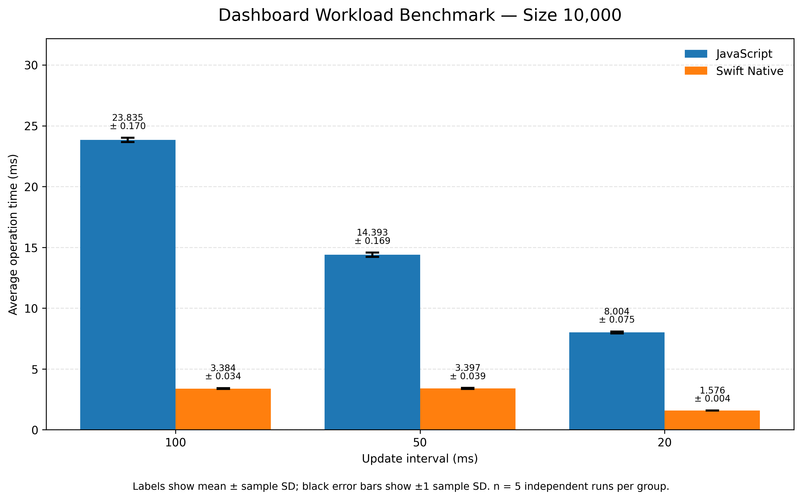
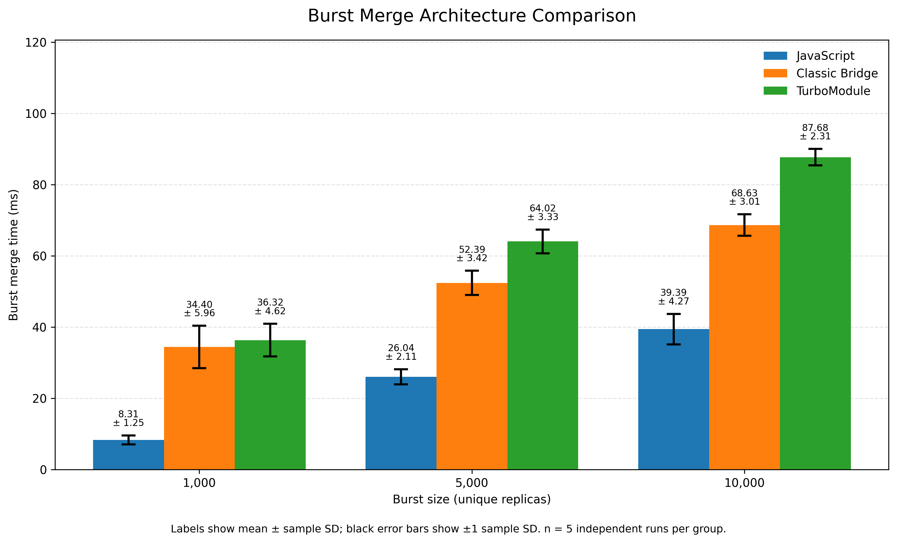
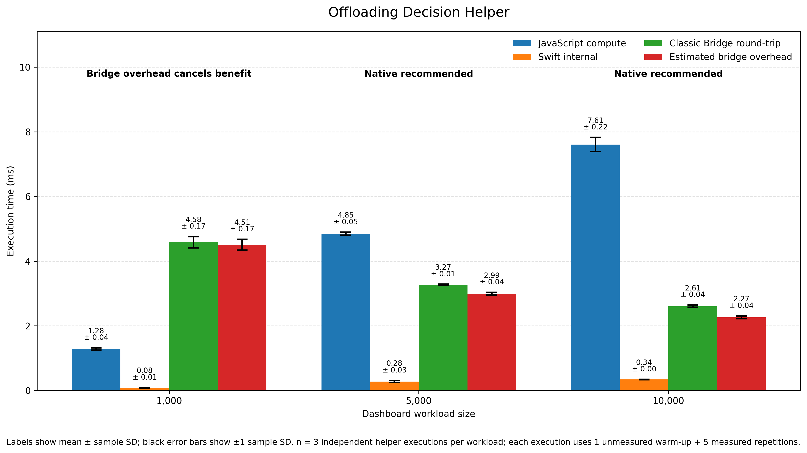

# CRDT Offloading Thesis Prototype

Prototype for the thesis:

**“Efficient Offloading of CRDT-Based State Synchronization in React Native: A Swift-Backed Approach for High-Frequency UI Updates.”**

This React Native iOS prototype evaluates whether lightweight CRDT-based state synchronization benefits from native execution in Swift, and how the JavaScript-to-native integration path affects performance.

The prototype compares:
- a JavaScript G-Counter baseline
- a Swift native module exposed through the React Native classic bridge
- a Swift TurboModule implementation for React Native New Architecture comparison

It also includes a deterministic dashboard-derived workload to evaluate native offloading under repeated UI update pressure.

## Prototype Scope

- **CRDT interval benchmark** for repeated G-Counter increments at `100ms`, `50ms`, and `20ms`
- **CRDT burst merge benchmark** for deterministic merges of `500`, `1000`, `5000`, and `10000` entries
- **Dashboard workload benchmark** for repeated synthetic dashboard computation with configurable workload size and update interval
- **Architecture comparison benchmark** for JavaScript, classic bridge, and TurboModule call patterns
- **Offloading Decision Helper** as a supplementary Classic Bridge runtime calibration for the selected dashboard workload
- **Secondary LWW Register validation** to cover the second lightweight CRDT type mentioned in the proposal
- **Supplementary Network Condition Demo** to support the temporary-disconnection and reconnection-burst demonstration described in the proposal

## Architecture Overview

- `src/crdt/js/` contains the JavaScript G-Counter baseline
- `ios/CRDTModule.swift` and `ios/CRDTModule.m` expose the Swift classic bridge implementation
- `ios/TurboCRDTCore.swift`, `ios/TurboCRDTModule.h`, and `ios/TurboCRDTModule.mm` provide the TurboModule / New Architecture implementation path
- `src/native/NativeCRDT.ts` and `src/native/TurboCRDT.ts` wrap native calls from TypeScript
- `src/metrics/` provides shared run logging and CSV export

The classic bridge path is kept as a legacy interoperability baseline. The TurboModule path is included to compare the same CRDT logic against React Native’s New Architecture integration model.

The Offloading Decision Helper is supplementary only. It runs one predetermined unmeasured warm-up repetition followed by five measured sequential repetitions for the currently selected dashboard workload. Warm-up timings are excluded from all reported statistics, no post-hoc outlier removal is performed, and the decision metric is the complete Classic Bridge round-trip mean rather than Swift internal time alone. Reported timing rows use mean ± sample standard deviation, results must pass checksum validation before logging, and the supplementary row is stored under `offloading_decision_helper` outside the primary statistical benchmark protocol.

## Run on iOS

Install dependencies:

```bash
npm install
cd ios
pod install
cd ..
```

Start Metro in one terminal:

```bash
npm start
```

Run the iOS app from another terminal.

For Simulator:

```bash
npx react-native run-ios --simulator "iPhone 17 Pro" --no-packager
```

For a connected physical iPhone:

```bash
npx react-native run-ios --device --no-packager
```

Recommended Xcode workspace:

```text
ios/RNOffloadingBenchmark.xcworkspace
```

## Measurement Notes

Final thesis results should be collected through repeated controlled runs. The recommended protocol is five repetitions per scenario, followed by mean and standard deviation analysis.

All final measurements should be collected on one consistent target environment, either a physical iPhone or the iOS Simulator. The selected environment should be reported with the results.

Manually stopped runs should be treated as inspection-only unless repeated under the same protocol.

Per-operation native scenarios intentionally include JavaScript-to-native call overhead. Burst scenarios evaluate a more practical batched offloading pattern where many updates are processed through a single native call.

Flipper, if used, is an optional debugging aid and not a source of performance measurements.

## Final Benchmark Results

The final raw datasets, processed statistical summaries, and thesis-ready figures are available under `results/`.

- Overview: [`results/README.md`](results/README.md)
- Raw datasets: [`results/raw/`](results/raw/)
- Processed summaries: [`results/processed/`](results/processed/)
- Final figures: [`results/figures/`](results/figures/)

### Selected results

#### Dashboard workload — size 10,000



#### Burst merge architecture comparison



#### Offloading Decision Helper


